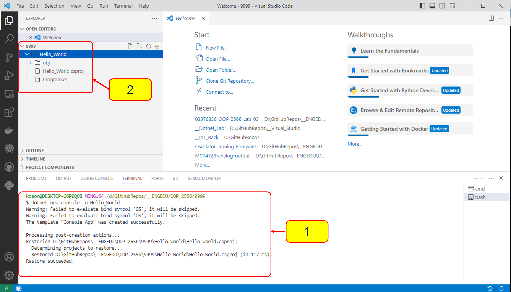
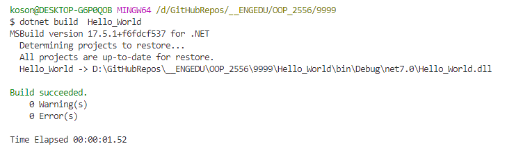
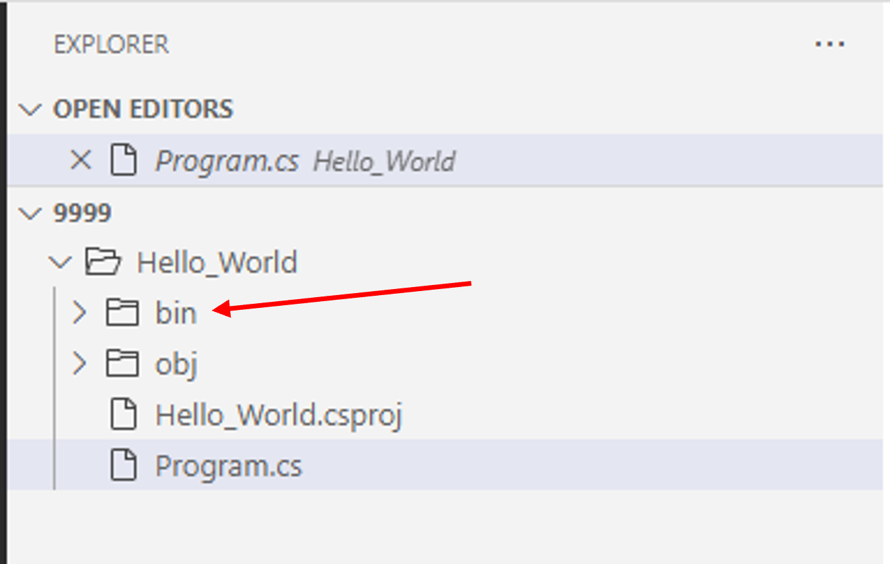
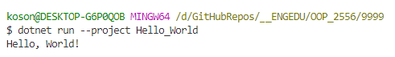
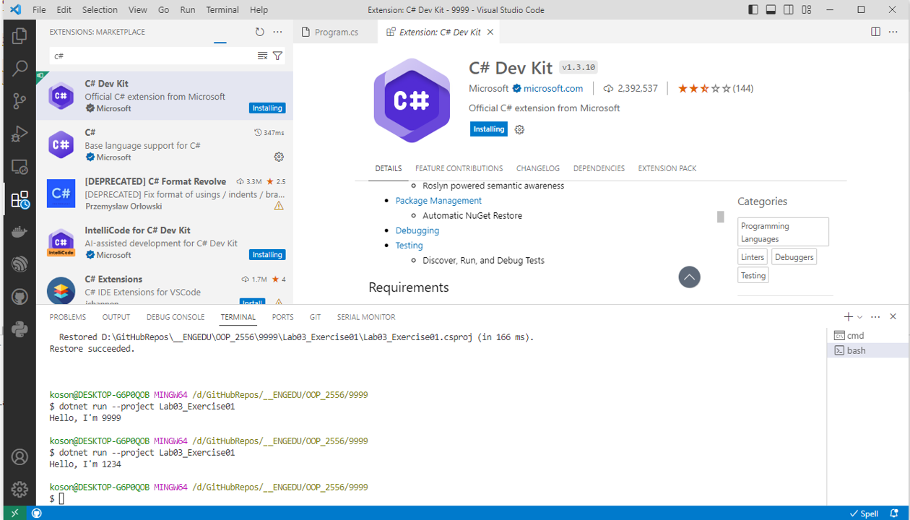

# การสร้าง project ด้วย dotnet CLI

## 3. ตัวอย่างการสร้างโปรแกรม

### 3.1 การสร้าง project แรก "Hello_World"

1. ใน terminal ของ visual studio code ให้พิมพ์คำสั่งต่อไปนี้

``` cmd
dotnet new console -n Hello_World
```



- dotnet จะสร้างโฟลเดอร์  hello world  พร้อมทั้งรายงานผลการทำงานที่หน้าจอ console

- ในขั้นนี้อาจจะมีคำเตือนบางอย่าง ถ้าไม่ร้ายแรง (ไม่กระทบต่อการสร้าง code)  ก็สามารถละเลยได้

2. คลิกเข้าไปดูในไฟล์ Program.cs จะเห็น source code ดังต่อไปนี้

```cs
// See https://aka.ms/new-console-template for more information
Console.WriteLine("Hello, World!");
```

ซึ่งเป็นการเขียนในสไตล์ top-level statement เริ่มใช้ครั้งแรกใน .NET 6.0 ดังนั้น ถ้าใครใช้ .NET < 6.0 ก็จะได้ code แบบสมบูรณ์ ดังต่อไปนี้

```cs
using System;
namespace Hello_World
{
    class Program
    {
        static void Main(string[] args)
        {
            Console.WriteLine("Hello World!");
        }
    }
}
```

3. ใน terminal ของ visual studio code ให้พิมพ์คำสั่งต่อไปนี้

``` cmd
dotnet build Hello_World
```



dotnet จะ build project และสร้าง folder ใหม่ขึ้นมาดังภาพ



4. ใน terminal ของ visual studio code ให้พิมพ์คำสั่งต่อไปนี้

``` cmd
dotnet run --project Hello_World
```

 จะได้ผลลัพธ์ดังตัวอย่าง



หมายเหตุ

ใน vscode มี extension หลายตัวที่ช่วยเขียนโปรแกรม เบื้องต้นให้ติดตั้ง extension C# Dev Kit จาก Microsoft


