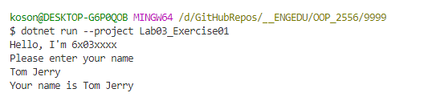

# Lab 3 Exercise 1

## Console.ReadLine() และ Console.WriteLine()  

1. สร้าง project ใหม่

```
dotnet new console -n Lab03_Exercise01
```

2. แก้ไข code ใน Program.cs เป็นดังนี้

```cs
System.Console.WriteLine("Hello, I'm 6x03xxxx");
System.Console.WriteLine("Please enter your name");
var name = System.Console.ReadLine();  
System.Console.WriteLine($"Your name is {name}");
```

### อธิบายโปรแกรม

- บรรทัดที่ 1 ให้นักศึกษาเปลี่ยน 6x03xxxx เป็นรหัสประจำตัวนักศึกษาของตนเอง
- บรรทัดที่ 2 แสดงข้อความออกทางหน้าจอ
- บรรทัดที่ 3 เป็นการอ่านข้อความ 1 บรรทัด (จบด้วยการกดปุ่ม enter)
- บรรทัดที่ 4 แสดงข้อความ `Your name is`   พร้อมทั้งข้อความที่รับมาจากบรรทัดที่ 3 ออกืทางหน้าจอ


3. ทดสอบโปรแกรมโดยการรันและป้อนชื่อของนักศึกษา แล้ว cutpture หน้าจอ

```
dotnet run --project Lab03_Exercise01
```

ตัวอย่างผลการรันโปรแกรม




## การส่งงาน

1. ให้สร้าง folder ชื่อ Lab_result ไว้ใน repository ของใบงานที่ fork มา
2. ในทุก Exercise ให้สร้างไฟล์ผลการทดลองชื่อ LabXX_ExerciseYY_resule.md แล้วใส้ภาพหรือคำอธิบายต่างๆ ลงไปในไฟล์นั้น (XX คือลำดับที่ของใบงาน, YY คือลำดับที่ของ Exercise)
3. ทำการ pull request เมื่อทำเสร็จทุก Exercise 

