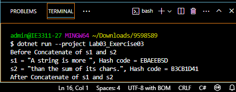

## ก่อนที่จะทำการต่อสตริง s2 กับ s1, เราแสดงค่าและ Hash code ของทั้ง s1 และ s2 ก่อน
## เมื่อทำการต่อสตริง s2 กับ s1 แล้ว เราจะเห็นว่าค่าของ s1 ได้ถูกเปลี่ยนแปลง แต่ s2 ไม่มีการเปลี่ยนแปลงใด ๆ หลังจากที่ต่อสตริงไปยัง s1 แล้ว