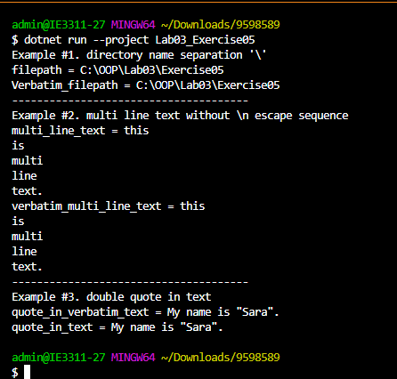

## ตัวแปร filepath กำหนดค่าเป็นสตริงที่ใช้เครื่องหมาย escape sequence \ เพื่อใส่ backslash ใน path
## ตัวแปร Verbatim_filepath กำหนดค่าด้วย verbatim string ซึ่งไม่ต้องใช้เครื่องหมาย escape sequence
## ตัวแปร multi_line_text และ verbatim_multi_line_text ใช้สำหรับสร้างสตริงที่มีหลายบรรทัด โดย multi_line_text ใช้เครื่องหมาย escape sequence \n ส่วน verbatim_multi_line_text ใช้ verbatim string
## ตัวแปร quote_in_text และ quote_in_verbatim_text ใช้สำหรับสร้างสตริงที่มีเครื่องหมาย double quote ในข้อความ โดย quote_in_text ใช้เครื่องหมาย escape sequence \" ส่วน quote_in_verbatim_text ใช้ verbatim string แทน