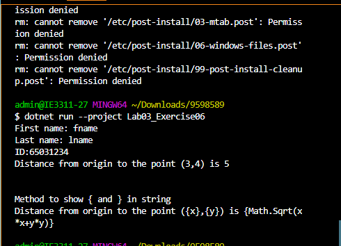

## ใช้ interpolated string ($"") เพื่อแสดงข้อมูลของนักศึกษา โดยนำค่าจากตัวแปร student มาแสดงผลโดยตรง โดยไม่ต้องใช้เครื่องหมายการต่อประสาน
## ใช้ verbatim interpolated string ($$"") เพื่อแสดงสตริง โดยที่เครื่องหมาย { และ } ในสตริงจะถูกแสดงเป็นตัวอักษรปกติ และไม่ถูกตีความว่าเป็นส่วนของ interpolated expression
## ใช้ verbatim interpolated string เช่นเดียวกัน แต่ในตัวสตริงกลางเป็นส่วนของ interpolated expression ที่คำนวณค่า จะแสดงผลลัพธ์ของนิพจน์นั้นในสตริงแทน