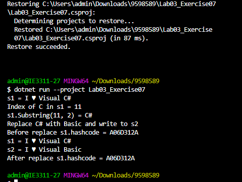

## ตัวแปร s1 ถูกกำหนดค่าให้เป็นสตริงที่ประกอบด้วยข้อความ "I ", ตามด้วย Unicode character \u0003 (เป็น character control แทน ASCII code 3) และ "Visual C# "
## เมื่อเรียกใช้เมทอด IndexOf() กับสตริง s1 และสตริงที่ต้องการค้นหา "C" จะคืนค่าลำดับ (index) แรกที่พบ "C" ในสตริง s1 โดยนับลำดับจาก 0
## เมื่อเรียกใช้เมทอด Substring() กับสตริง s1 และระบุตำแหน่งเริ่มต้น (indexOfC) และความยาว (2) จะคืนค่าสตริงที่เริ่มต้นที่ตำแหน่ง indexOfC และยาว 2 ตัวอักษร
## เมื่อเรียกใช้เมทอด Replace() กับสตริง s1 โดยระบุสตริงที่ต้องการแทนที่ ("C#") ด้วยสตริงที่ต้องการใช้แทนที่ ("Basic") จะคืนค่าสตริงใหม่ที่ถูกแทนที่ "C#" ด้วย "Basic" และไม่เปลี่ยนแปลงสตริงต้นฉบับ s1. ความสำคัญคือการใช้เมทอด Replace() จะสร้างสตริงใหม่แทนที่เมทอดนี้จะไม่เปลี่ยนแปลงสตริงต้นฉบับโดยตรง ซึ่งเป็นแนวทางการที่พบบ่อยในการทำงานกับสตริงใน C#