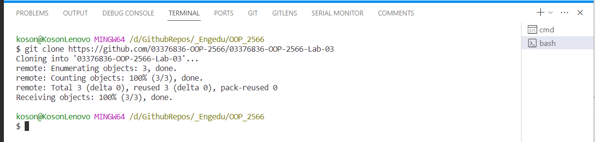

# Lab3  การพัฒนา software ด้วยภาษา C# โดยใช้ VSCODE และ dotnet command line

## 1. Introduction

ถึงแม้ว่าเราสามารถใช้ visual studio ในการสร้างและรัน C# project ดังที่ได้ทดลองในใบงานที่ผ่านมา IDE ดังกล่าวจะมีเครื่องมือต่าง ๆ ให้ใช้จำนวนมาก แต่จะมีขั้นตอนจำนวนมากในการสร้าง project ชนิดต่าง ๆ เป็นผลให้เสียเวลาทำการทดลองกับ code ขนาดเล็ก  

เพื่อความสะดวกและรวดเร็วในการสร้างและรันโปรแกรม เรามีอีกทางเลือกหนึ่งคือการใช้ dotnet command line  (dotnet CLI) เพื่อทดลองในใบงานต่าง ๆ นอกจากนี้ dotnet CLI  ยังช่วยสร้างไฟล์ project ซึ่งช่วยให้เราสามารถเปิด project ใน IDE ของ visual studio ได้อีกด้วย

### 1.1.1 การเตรียมการทดลอง

1. เรียก Windows File Explorer ขึ้นมา (กดปุ่ม Windows - E) แล้วย้ายเข้าไปทำงานใน folder งานของวิชา OOP บน harddisk ของตัวเอง

2. คลิกขวา เรียก vscode เพื่อให้ vscode ทำงานกับ folder นั้น
    
    

3. ใน vscode ถ้ายังไม่มี terminal pane ให้เรียกเมนู View->Terminal

   

4. ใน Terminal panel เรียก git bash terminal

   

5. clone repository โดยใช้คำสั่ง 

```
git clone  https://github.com/03376836-OOP-2566/03376836-OOP-2566-Lab-03.git
```

   

6. ย้ายเข้าไปใน folder ของใบงาน แล้วสร้าง folder สวนตัว โดยใช้รูปแบบ  `Lab3-xxxx` เมื่อ `xxxx` คือ เลขสี่ตัวท้้ายของรหัสนักศึกษา ด้วยคำสั่ง mkdir xxxx และเรียกดูโดยคำสั่ง ls

   


### 1.1.2 ตรวจสอบว่าได้มีการติดตั้ง dotnet software development kit ในเครื่องหรือยัง

1. พิมพ์คำสั่ง `dotnet --list-sdks` จะเห็น version และตำแหน่งที่ตั้งของ sdk

   

ถ้ายังไม่ได้ติดตั้ง version ใดๆ ให้ติดตั้ง dotnet sdk รุ่น 6 ขึ้นไป

ถ้าพิมพ์ `dotnet --list-sdks` แล้วได้ผลดังในภาพด้านบน แสดงว่าเครื่องคอมพิวเตอร์มีความพร้อมที่จะทดลองด้วย dotnet CLI แล้ว

